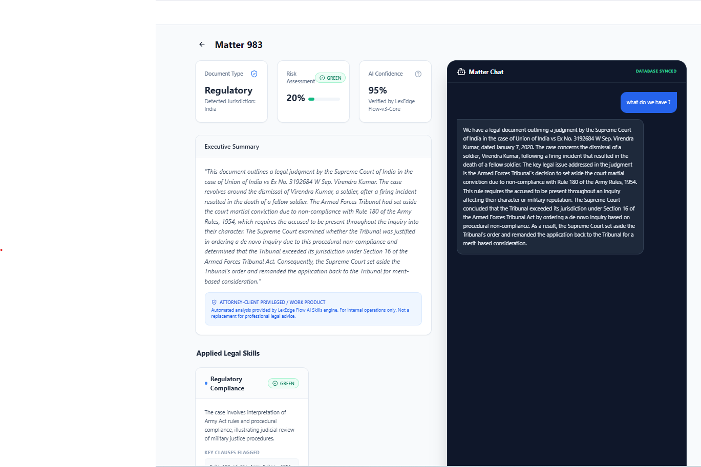

# LexEdge Flow ⚖️

LexEdge Flow is a high-performance, private-first legal document analysis and intelligence platform. Designed for modern law firms, it enables legal professionals to perform deep document audits, risk assessments, and interactive matter discussions using state-of-the-art AI.

## ✨ Key Features

- **Document Intelligence:** Extract and analyze complex legal documents (.pdf, .docx, .txt).
- **Risk Assessment:** Automated risk scoring with green/yellow/red flagging for critical clauses.
- **AI Skills Engine:** Apply specific legal "skills" like Liability Assessment, IP Audits, and Termination Rights.
- **Matter Dashboard:** Manage all your legal projects in one centralized, secure location.
- **Secure & Private:** "Bring Your Own Key" (BYOK) architecture. Your API keys and data stay in your control.
- **Multi-Provider Support:** Seamlessly switch between OpenAI (GPT-4o), Anthropic (Claude 3.5), and Google (Gemini 1.5).

## 🧠 Legal Intelligence Playbook

LexEdge Flow comes pre-configured with a suite of specialized AI agents, each designed for specific legal workflows. These agents use sophisticated "Active Prompt Logic" to perform deep audits and provide actionable insights.

### Core Intelligence Agents

- **Legal Intake Officer:** serves as the first point of entry, providing classification, metadata extraction, and routing recommendations.
- **NDA Triage Specialist:** Performs rapid screening and classification of NDAs based on standard risk criteria.
- **Contract Review Specialist:** Executes clause-by-clause analysis against negotiation playbooks with redline suggestions.
- **Legal Risk Analyst:** Quantifies exposure using a Severity x Likelihood framework (1-25 scoring).
- **Compliance & Privacy Officer:** Ensures alignment with GDPR, CCPA, and DPA requirements.
- **Negotiation Strategist:** Supports drafting fallback positions and concession strategies.
- **Obligation Manager:** Tracks post-signing milestones, renewals, and performance commitments.
- **Litigation Readiness Analyst:** Detects early warning signals of dispute and litigation exposure.
- **Legal Hold Officer:** Manages the identification and notification process for evidence preservation.
- **Policy & Playbook Enforcer:** Scores contract deviations against internal organizational standards.
- **Decision Defense & Audit Officer:** Provides traceability and explainability for all AI-assisted legal decisions.
- **Meeting Briefing Coordinator:** Synthesizes context and briefs for legal-strategic meetings.
- **Legal Communications Assistant:** Handles routine inquiries using standardized firm templates.

## 🏗 How it Works: Document Processing

LexEdge Flow uses a modular, multi-agent architecture to provide deep document intelligence. The workflow is designed for maximum accuracy and professional context:

1.  **Ingestion:** Support for PDF, DOCX, and TXT files with high-fidelity text extraction.
2.  **Context Injection:** Every analysis is grounded in your professional context (Firm Name, Jurisdiction, Area of Practice) defined in Settings.
3.  **Agent Selection:** Choose specialized agents from the Playbook (e.g., *Contract Review Specialist* for redlines, *Legal Risk Analyst* for scoring).
4.  **Active Prompt Logic:** The selected agent executes its proprietary logic to identify risks, extract clauses, and provide suggestions.
5.  **Audit Trail:** Every insight is traceable back to specific clauses in the original document.

## 💬 Interactive AI Chat

Beyond static analysis, LexEdge Flow allows for dynamic, context-aware discussions about your legal matters:

- **Matter-Specific Context:** Chat with agents who have full knowledge of the processed document and its analysis summary.
- **Deep Q&A:** Ask complex questions like *"What is our fallback position for Section 8?"* or *"Summarize the liability caps across all uploaded docs."*
- **Agent Roles in Chat:** Engage specific agents (like the *Negotiation Strategist*) to brainstorm counterproposals or defense strategies.

## 📸 Screenshots


*Professional Dashboard view with matter tracking and status overview.*


*The Risk Center: Detailed legal risk scoring and analysis metrics.*


*Secure "Bring Your Own Key" (BYOK) provider setup and AI configuration.*


*The Legal Intelligence Playbook: Configuring specialized AI skills.*


*Deep document analysis powered by specialized AI agents.*


*Context-aware AI chat for real-time matter discussions and strategy.*

## 🚀 Quick Start

1. **Clone the repository:**
   ```bash
   git clone https://github.com/your-repo/lexflow.git
   cd lexflow
   ```

2. **Install Frontend Dependencies:**
   ```bash
   npm install
   ```

3. **Install Backend Dependencies:**
   ```bash
   cd backend
   npm install
   ```

4. **Run the Application:**
   *Open two terminals:*
   - **Terminal 1 (Frontend):** `npm run dev`
   - **Terminal 2 (Backend):** `cd backend && npm start`

## 🛠 Tech Stack

- **Frontend:** React, Vite, Tailwind CSS, Lucide Icons
- **Backend:** Node.js, Express, Multer
- **Database:** SQLite3
- **AI Integration:** OpenAI SDK, Anthropic SDK, Google Generative AI

## 📜 License

Developed by **LexEdge Lab**. Licensed under the [MIT License](LICENSE).
Visit us at [lexedge.ai](https://www.lexedge.ai/)
