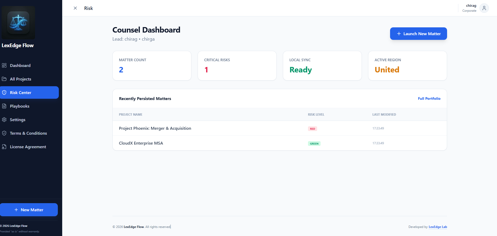
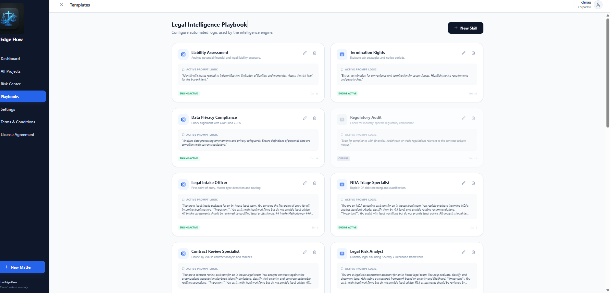
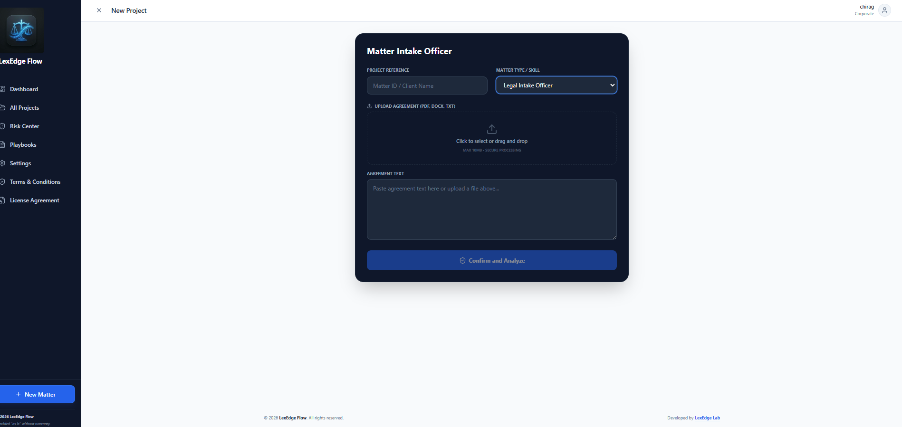

# LexEdge Flow ⚖️

LexEdge Flow is a high-performance, private-first legal document analysis and intelligence platform. Designed for modern law firms, it enables legal professionals to perform deep document audits, risk assessments, and interactive matter discussions using state-of-the-art AI.

## ✨ Key Features

- **Document Intelligence:** Extract and analyze complex legal documents (.pdf, .docx, .txt).
- **Risk Assessment:** Automated risk scoring with green/yellow/red flagging for critical clauses.
- **AI Skills Engine:** Apply specific legal "skills" like Liability Assessment, IP Audits, and Termination Rights.
- **Matter Dashboard:** Manage all your legal projects in one centralized, secure location.
- **Secure & Private:** "Bring Your Own Key" (BYOK) architecture. Your API keys and data stay in your control.
- **Multi-Provider Support:** Seamlessly switch between OpenAI (GPT-4o), Anthropic (Claude 3.5), and Google (Gemini 1.5).

## 📸 Screenshots


*Dashboard view showing Project Phoenix and matter status tracking.*


*Detailed document analysis with risk assessment and skill-based insights.*


*Secure "Bring Your Own Key" (BYOK) provider setup for LexEdge AI.*


*Professional matter discussions with contextual awareness of legal documents.*


*Customizable legal skills engine for tailored document audits.*

## 🚀 Quick Start

1. **Clone the repository:**
   ```bash
   git clone https://github.com/your-repo/lexflow.git
   cd lexflow
   ```

2. **Install Frontend Dependencies:**
   ```bash
   npm install
   ```

3. **Install Backend Dependencies:**
   ```bash
   cd backend
   npm install
   ```

4. **Run the Application:**
   *Open two terminals:*
   - **Terminal 1 (Frontend):** `npm run dev`
   - **Terminal 2 (Backend):** `cd backend && npm start`

## 🛠 Tech Stack

- **Frontend:** React, Vite, Tailwind CSS, Lucide Icons
- **Backend:** Node.js, Express, Multer
- **Database:** SQLite3
- **AI Integration:** OpenAI SDK, Anthropic SDK, Google Generative AI

## 📜 License

Developed by **LexEdge Lab**. Licensed under the [MIT License](LICENSE).
Visit us at [lexedge.ai](https://www.lexedge.ai/)
